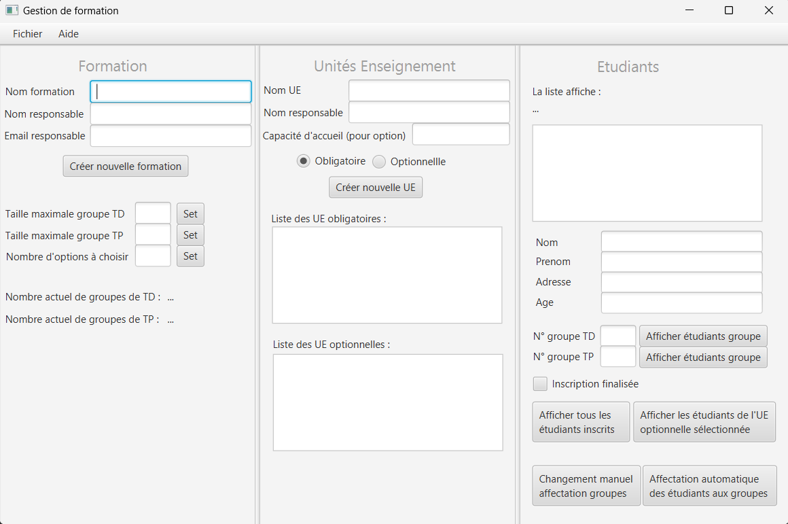
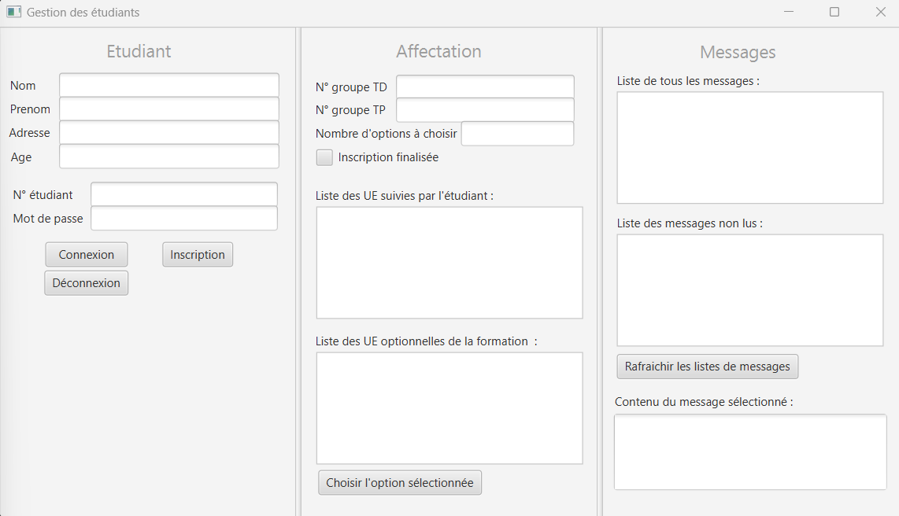
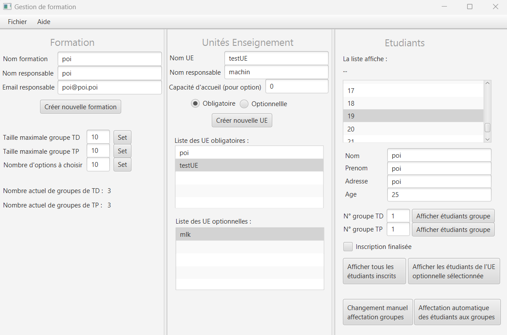
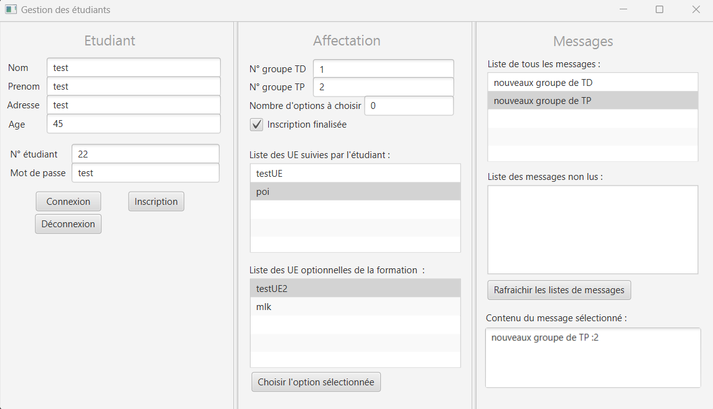

# Gestion d'année universitaire et d'etudiant en java,javafx,junit

Dans ce projet, une personne peut créer une année universitaire ainsi que des UE (matières) optionnelles ou non, avec un nombre de places limité ou non. Elle peut également affecter des groupes de TD/TP aux étudiants.
Les étudiants peuvent s'inscrire et se connecter pour consulter leurs messages, choisir leurs options et voir leur affectation de groupe.
Il est possible de sauvegarder les données dans un fichier.


### Installation des dépendances :

- **JavaFx**  
  - Bibliotheque fournie avec le projet dans lib

- **Junit**  
  - Déja dans le projet

### Exemple : 










### Acquis :

- **JavaFx**

     ```java
    @FXML
  private ListView<String> listeEtudiants;
  
  @FXML
  private ListView<String> listeUEObligatoires;
  
  @FXML
  private ListView<String> listeUEOptionnelles;
  
  @FXML
  private ToggleGroup obligation;
  
  @FXML
  private RadioButton radioBoutonObligatoire;
  
  @FXML
  private RadioButton radioBoutonOptionnelle;
  
  /**
   * Réagit au clic sur le bouton d'affectation automatique en vérifiant
   * d'abord si une formation est sélectionnée. Si une formation est
   * sélectionnée et que les tailles de groupe dirigé et pratique sont
   * spécifiées, la méthode attribue automatiquement les groupes de travaux
   * dirigés et pratiques via l'appel de la méthode
   * {@link GestionFormation#attribuerAutomatiquementGroupes()}. Ensuite, met à
   * jour les labels affichant le nombre de groupes de travaux dirigés et
   * pratiques affectés. En cas d'absence de formation, affiche une alerte
   * d'erreur indiquant "Aucune Formation". Si les tailles des groupes ne sont
   * pas définies, affiche une alerte d'erreur indiquant "Les tailles des
   * groupes non définies".
   *
   * @param event L'événement déclenché par le clic sur le bouton.
   */
  @FXML
  void actionBoutonAffectationAutomatique(ActionEvent event) {
    if (ges.getNomFormation() != null) {
      if (ges.getTailleGroupeDirige() != -1
          && ges.getTailleGroupePratique() != -1) {
        ges.attribuerAutomatiquementGroupes();
        labelNbGroupesTD
            .setText(Integer.toString(ges.nombreGroupesTravauxDiriges()));
        labelNbGroupesTP
            .setText(Integer.toString(ges.nombreGroupesTravauxPratiques()));
      } else {
        this.afficherPopup("Les taille des groupe non définis",
            AlertType.ERROR);
      }
    } else {
      this.afficherPopup("Aucune Formation", AlertType.ERROR);
    }
  }
  
     ```

- **Serialization**
    ```java
    /**
   * Sauvegarde toutes les donn�es de la formation : liste des UEs, des
   * �tudiants et des groupes.
   *
   * @param nomFichier le fichier dans lequel sauvegarder les donn�es
   * @throws IOException en cas de probl�me de sauvegarde
   */
  @Override
  public void sauvegarderDonnees(String nomFichier) throws IOException {
    try (FileOutputStream fileOut = new FileOutputStream(nomFichier);
        ObjectOutputStream objectOut = new ObjectOutputStream(fileOut)) {
      objectOut.writeObject(this);
    } catch (IOException e) {
      System.err.println(
          "Erreur lors de la sauvegarde des données : " + e.getMessage());
      throw e;
    }
  }

    ```

- **Junit**
    ```java
    /**
   * Test de la méthode getEtudiantConnecte
   * {@link GestionEtudiant#getEtudiantConnecte()} avec un utilisateur pas
   * connecté. Vérifie que la méthode renvoie NonConnecteException.
   * 
   * @see GestionEtudiant#getEtudiantConnecte()
   */
  @Test
  void testEtudiantConnecteSansUtilisateurConnecte() {
    try {
      this.gestionEtudiant.getEtudiantConnecte();
      assertTrue(false);
    } catch (NonConnecteException e) {
      assertTrue(true);
    }
  }
  
  /**
   * Test de la méthode getListeEtudiants
   * {@link GestionEtudiant#getListeEtudiants()} avec deux étudiants dans la
   * liste. Vérifie que la méthode renvoie bien la liste des étudiants.
   * 
   * @see GestionEtudiant#getListeEtudiants()
   */
  @Test
  void testListeEtudiants() {
    Set<Etudiant> lsEtudiants = this.gestionEtudiant.getListeEtudiants();
    assertEquals(lsEtudiants.size(), 2);
  }
  
  /**
   * Test de la méthode enseignementsObligatoires
   * {@link GestionEtudiant#enseignementsObligatoires()} avec 2 ue obligatoires
   * dans la liste. Vérifie que la méthode renvoie bien la liste des ue
   * obligatoires.
   * 
   * @see GestionEtudiant#enseignementsObligatoires()
   */
  @Test
  void testEnseignementObligatoires() {
    Set<UniteEnseignement> lsUEO =
        this.gestionEtudiant.enseignementsObligatoires();
    assertEquals(this.listeUEO, lsUEO);
  }
    ```
